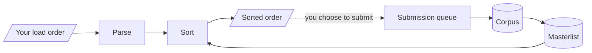

# VOLO

[](https://github.com/Moonie8t7/VOLO/actions/workflows/checks.yml)

Verified Order and Load Optimisation: a community-curated load order tool for
**Baldur's Gate 3**, in the spirit of [LOOT](https://loot.github.io/) for
Bethesda titles.

[volobg3.com](https://volobg3.com) · [VOLO on Nexus Mods](https://www.nexusmods.com/baldursgate3/mods/24316)

## What it does

Drop in a BG3 Mod Manager export or the game's own `modsettings.lsx`. VOLO sorts
it against a masterlist built from load orders players actually played on,
resolves declared dependencies, explains every placement, and hands the file
back.

Sorting runs entirely in your browser and needs no account. Your load order is
never uploaded; the only endpoint on the site is `functions/api/submit.js`, and
nothing reaches it unless you choose to submit an order from the Submit page.
Mods from Nexus Mods and from mod.io, the platform behind the official in-game
mod manager, are both supported.

Measured on orders it has never seen, VOLO agrees with them **61.6 percent** of
the time against **50.7 percent** for a random shuffle. That figure averages
orders rather than mods, so a 41-mod order weighs as much as a 999-mod one,
though weighting by mods barely moves it. It is a sorting aid with evidence
behind it, not an oracle.

## Quick start

```bash
npm install
npm run dev        # http://localhost:5173
npm run check      # typecheck
npm test           # the optimiser against the real corpus, then every tracked file
npm run build      # masterlist, sitemap, bundle, then prerender every route
node scripts/serve-dist.mjs   # serve dist/ the way the host does
```

Use `serve-dist.mjs` rather than `npm run preview` to check anything about
routing. Vite's preview server answers every unknown path with `index.html`,
so it reports a missing or misnamed route as working.

## Documentation

| Document | What it covers |
|---|---|
| [docs/architecture.md](docs/architecture.md) | How the pieces fit together, and what runs where |
| [docs/decisions.md](docs/decisions.md) | What was measured, adopted and rejected |
| [docs/workflow.md](docs/workflow.md) | Scripts, evaluation and the automated pipelines |
| [CONTRIBUTING.md](CONTRIBUTING.md) | Submitting load orders, and the licence split |
| [SECURITY.md](SECURITY.md) | What is in scope, and how to report something privately |

## Architecture



Astra's Load Order Dividers are the skeleton: a hundred-odd labelled positions
that a mod is placed on whether or not the divider paks are installed. Which
position comes from the strongest evidence available, in order: curated
overrides, section headers modders wrote in their own orders, the mod's name
read against the divider vocabulary, its Nexus or mod.io listing category,
where its author's other catalogued mods sit, then inference from its
neighbours in submitted orders. A mod with none of these
waits at the end of the order, where submitted orders put mods nobody has
placed. Within a position, the sequence learned from working orders decides,
and mods it knows nothing about keep the order you gave them.

Declared dependencies sit outside all of that as hard graph edges: a mod is
never emitted before something it requires, whatever the positions say.

Full detail in [docs/architecture.md](docs/architecture.md).

## The masterlist

`masterlist/bg3-masterlist.json` covers 7,043 mods. 4,153 were
categorised from section headers modders wrote in their own orders,
1,340 from name patterns, 653 from a Nexus or mod.io listing,
16 from where their author's other catalogued mods sit, 195 inferred
from their neighbours, 23 from curated overrides, and 663 are not
categorised at all. 6,372 of the 7,043 sit on a divider position.

These move as the corpus grows.
[masterlist/coverage-report.md](masterlist/coverage-report.md) is regenerated on
every build and is the one to trust if the two ever disagree; it also breaks
down what is known versus guessed. [masterlist/README.md](masterlist/README.md)
covers the data licence.

## Known constraints

32 working orders is a small corpus, and it is the binding constraint on
quality rather than the algorithm. Several plausible improvements have measured
*worse* than doing nothing, all recorded in
[docs/decisions.md](docs/decisions.md). More submissions beat more cleverness.

Held-out agreement is a weak guide to whether a change is good. It scores the
sort against orders that already work, so any movement costs points and doing
nothing scores well; a mod left at the end because nothing is known about it is
rewarded precisely because unplaced mods cluster there. Read it alongside the
per-order and mod-weighted splits rather than on its own.

663 mods have no category from any source. Almost all appeared in exactly one
submitted order, so there is nothing to infer from.

The automated checks parse VOLO's own output with VOLO's own parser, which is
circular and cannot tell you the game accepts the file. Exports have been loaded
in BG3 by hand and worked, but that is a manual step outside the test suite, so
treat a green `npm test` as evidence the sorter is consistent rather than proof
the game is happy.

## Licence

VOLO is licensed in parts, because the code and the data want different terms.

| Part | Licence | Where |
|---|---|---|
| Application code | MIT | [LICENSE](LICENSE) |
| Masterlist and submitted corpus | CC0-1.0 | [masterlist/LICENSE](masterlist/LICENSE) |
| Documentation | CC BY 4.0 | this file and `docs/` |
| Name, logo, visual identity | All rights reserved | [TRADEMARKS.md](TRADEMARKS.md) |
| Third party components | Their own terms | [NOTICE](NOTICE) |

The data is CC0 deliberately. Load order information is more useful as shared
infrastructure than as anyone's property, and players contributed it so that
everyone sorts better; another BG3 tool is welcome to take the masterlist
wholesale. What is not licensed is the project's identity, so a fork can use
everything here but should not present itself as VOLO.

MIT rather than GPL because VOLO is a hosted web application, where ordinary GPL
adds friction for contributors without covering the likeliest copying scenario:
someone running a modified copy as a service, which is not distribution. If
preventing that ever matters more than ease of adoption, the licence that
addresses it is AGPL-3.0-or-later, not GPL.

## Credits

Load order dividers by
[Astralities](https://forums.nexusmods.com/profile/106303673-astralities/), who
made Astra's Load Order Dividers for their own playthroughs and gave permission
to include and adapt the set here. The divider paks in
`public/downloads/astras-dividers.zip` are their work.

VOLO is an independent community project, not affiliated with Larian Studios,
Nexus Mods or mod.io.
