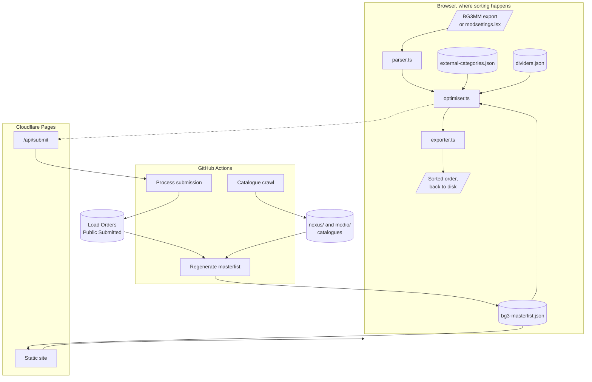
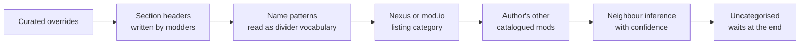

# Architecture

VOLO is a static site with no backend. Sorting happens in the browser; the only
server-side code is one Cloudflare Pages Function that opens a GitHub issue on a
submitter's behalf.

## The shape of it

## Where the order comes from

Placement is decided by evidence, strongest first. Anything a stronger tier
settles is never revisited by a weaker one.

Curated rules are the only tier that states a constraint rather than measuring
a habit, and they live in `masterlist/curated-rules.json` so that curating does
not mean editing code. A rule names a divider slot directly, so a person can say
"Compatibility Framework belongs at 105" and be obeyed exactly, overruling a
corpus that files it as a library.

That file also carries the two things a statistic cannot express: mods that must
not be installed together, and warnings written about a specific mod. Neither is
ever mined. Two mods appearing in an order that broke is not evidence they
conflict, and publishing that claim about a real author's work on that basis
would be false rather than cautious.

Every pattern carries examples it must match, and the smoke test fails the build
otherwise. Three pattern tables in this project have silently stopped matching
anything, twice through an escape being eaten in an edit.

Name patterns run ahead of listing categories because a name can name a precise
position (`045 Skillset Feats`) where a listing only ever gives a coarse group.
The author tier speaks only for a specialist: at least three catalogued mods,
at least eighty percent of them in one group, so an author who only ever makes
one kind of thing can vouch for a mod whose name says nothing. Neighbour
inference runs last because it is the only tier that reads other mods'
answers, so it should see them settled first.

The listing tier is also consulted in the browser at sort time, over the full
Nexus and mod.io catalogues, so a mod published yesterday sorts by its own
listing without waiting for anyone to submit it. The catalogues index every
name the crawlers have seen a listing under, plus the mod.io URL slug, which
usually still carries the title the mod was created with; installed paks keep
the name they shipped under, so those older names are exactly what stale paks
match. A rename from before the crawlers watched, on a mod whose slug was
edited too, is the one case that still misses.

Astra's Load Order Dividers are the skeleton, and a mod is placed on one whether
or not the divider paks are installed. Inside a position, the order learned from
submitted working orders decides, and mods it knows nothing about keep the order
the user gave them.

Declared dependencies sit outside the tiers entirely, as hard graph edges in
Kahn's algorithm. No position or learned sequence can emit a mod before
something it requires.

## The client

| File | Responsibility |
|---|---|
| `client/src/lib/parser.ts` | Reads every supported format into a common shape. Never throws. |
| `client/src/lib/optimiser.ts` | Kahn's algorithm over the dependency graph. Pure, no I/O. |
| `client/src/lib/exporter.ts` | Writes BG3MM JSON, modsettings.lsx, CSV, text, Markdown. |
| `client/src/lib/masterlist.ts` | Fetches the masterlist. Degrades to the bundled copy. |
| `client/src/lib/listing.ts` | Fetches the Nexus and mod.io category index, the same way. |
| `client/src/lib/store.tsx` | Session state. Persists only if the user opts in. |
| `client/src/lib/submit.ts` | Posts a submission to `/api/submit`. |
| `client/src/lib/head.ts` | Per-route title, description, canonical and robots tags. |

Every route is rendered to its own HTML file at build time by
`scripts/prerender.mjs`, so the served page contains its text before any
JavaScript runs. The browser hydrates that markup rather than rebuilding it.

Two things follow from each route being a real file. The host needs no rewrite
rules to map paths onto the shell, and an address that is not a route matches
nothing, which is what lets `public/404.html` answer with a genuine 404 instead
of a page that returns 200 and then says it does not exist.

`scripts/serve-dist.mjs` serves `dist/` the way the host resolves it, because
`vite preview` answers every unknown path with `index.html` and would report a
missing route as working.

The sort runs in O(V + E). A thousand mods take about three milliseconds, which
matters because an earlier hosted version timed out and was misdiagnosed as a
data-size problem.

## What runs on a schedule

| Workflow | Trigger | What it does |
|---|---|---|
| Catalogue crawl | Daily 04:20 UTC | Crawls Nexus and mod.io, rebuilds derived data, commits |
| Process submission | A labelled issue | Validates, gates, then lands it or opens a pull request |
| Regenerate masterlist | Corpus change on main | Rebuilds the masterlist from the whole corpus |

All three share a `masterlist` concurrency group, so two runs can never
regenerate over each other.

## Why there is no backend

An earlier version fetched mod pages per request, which meant a thousand-mod
list spent about eighteen minutes on network calls and rate limits. Everything
external is now crawled ahead of time into committed JSON, so a user's browser
never talks to Nexus or mod.io at all. The only fetches beyond the site itself
are the masterlist and category index from this repository on GitHub; each is
requested on load and used only when newer than the bundled copy. See
[decisions.md](decisions.md).
