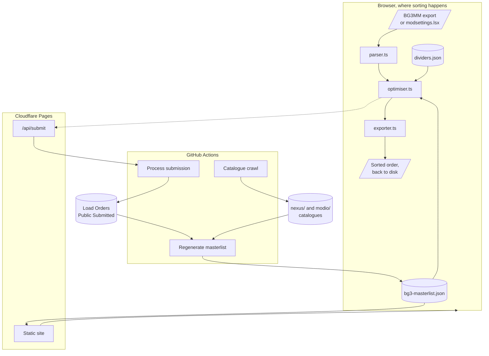
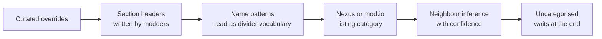

# Architecture

VOLO is a static site with no backend. Sorting happens in the browser; the only
server-side code is one Cloudflare Pages Function that opens a GitHub issue on a
submitter's behalf.

## The shape of it

## Where the order comes from

Placement is decided by evidence, strongest first. Anything a stronger tier
settles is never revisited by a weaker one.

Name patterns run ahead of listing categories because a name can name a precise
position (`045 Skillset Feats`) where a listing only ever gives a coarse group.
Neighbour inference runs last because it is the only tier that reads other
mods' answers, so it should see them settled first.

Astra's Load Order Dividers are the skeleton, and a mod is placed on one whether
or not the divider paks are installed. Inside a position, the order learned from
submitted working orders decides, and mods it knows nothing about keep the order
the user gave them.

Declared dependencies sit outside the tiers entirely, as hard graph edges in
Kahn's algorithm. No position or learned sequence can emit a mod before
something it requires.

## The client

| File | Responsibility |
|---|---|
| `client/src/lib/parser.ts` | Reads every supported format into a common shape. Never throws. |
| `client/src/lib/optimiser.ts` | Kahn's algorithm over the dependency graph. Pure, no I/O. |
| `client/src/lib/exporter.ts` | Writes BG3MM JSON, modsettings.lsx, CSV, text, Markdown. |
| `client/src/lib/masterlist.ts` | Fetches the masterlist. Degrades to the bundled copy. |
| `client/src/lib/store.tsx` | Session state. Persists only if the user opts in. |
| `client/src/lib/submit.ts` | Posts a submission to `/api/submit`. |

The sort runs in O(V + E). A thousand mods take about three milliseconds, which
matters because an earlier hosted version timed out and was misdiagnosed as a
data-size problem.

## What runs on a schedule

| Workflow | Trigger | What it does |
|---|---|---|
| Catalogue crawl | Daily 04:20 UTC | Crawls Nexus and mod.io, rebuilds derived data, commits |
| Process submission | A labelled issue | Validates, gates, then lands it or opens a pull request |
| Regenerate masterlist | Corpus change on main | Rebuilds the masterlist from the whole corpus |

All three share a `masterlist` concurrency group, so two runs can never
regenerate over each other.

## Why there is no backend

An earlier version fetched mod pages per request, which meant a thousand-mod
list spent about eighteen minutes on network calls and rate limits. Everything
external is now crawled ahead of time into committed JSON, so a user's browser
makes no third-party requests at all. See [decisions.md](decisions.md).
