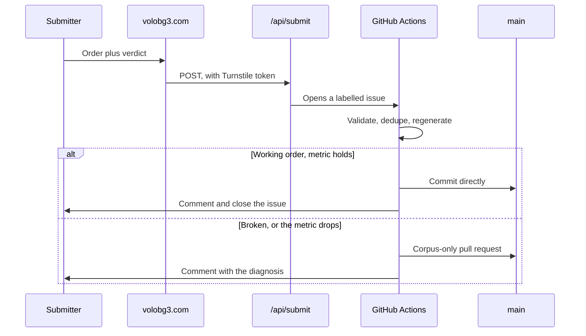

# Development workflow

## Prerequisites

Node 22 and npm. Nothing else; there is no backend to run.

## First-time setup

```bash
npm install
npm run dev        # http://localhost:5173
```

## Daily loop

```bash
npm run check      # typecheck
npm test           # the optimiser against the real corpus
npm run build      # regenerate the masterlist, then build to dist/
```

`npm run masterlist` re-mines `Load Orders - Public Submitted/` on its own. Run
it when new submissions arrive.

## Before changing how sorting works

```bash
node scripts/verify-holdout.mjs
```

Run it before and after. It rebuilds the masterlist once per working order with
that order left out, so it measures generalisation rather than memory. Quote
that number, not the higher one `verify-order.mjs` prints.

Several plausible ideas have measured worse. See [decisions.md](decisions.md)
before rebuilding one.

## After deploying

```bash
npm run verify-deploy
```

Waits for the deployment, then checks every asset serves the right content type
in both plain and browser-style CORS requests, repairing the edge cache if it is
holding a bad answer.

## Scripts

| Script | Purpose |
|---|---|
| `mine-corpus.mjs` | Builds the masterlist from the corpus. Supports `--exclude` and `--out`. |
| `verify-order.mjs` | In-sample agreement. Relative comparisons only. |
| `verify-holdout.mjs` | Held-out agreement. The honest number. |
| `smoke-test.mjs` | Asserts the sort's promises against every corpus order. |
| `diagnose-order.mjs` | Explains what is probably wrong with a broken order. |
| `process-submission.mjs` | Validates a submission, gates it, writes the report. |
| `bulk-list-nexus.mjs` | Crawls the Nexus catalogue. `--updates` for the daily top-up. |
| `bulk-list-modio.mjs` | Crawls mod.io. `--updates` and `--deps`. |
| `crawl-requirements.mjs` | Harvests author-declared requirement tables. |
| `build-divider-map.mjs` | Turns the divider paks into the client's taxonomy. |
| `crawl-summary.mjs` | One readable summary of catalogue and masterlist state. |
| `verify-deploy.mjs` | Verifies and repairs a deployment. |

## Environment

`.env` holds `NEXUS_API_KEY` and `MODIO_API_KEY` for local crawling. The same
values live as repository secrets so the scheduled crawl runs without anyone's
machine being on. Crawling locally is no longer necessary.

## How a submission travels



The gate is deliberately narrow: a working order that parses, is not a
duplicate, and does not drop agreement by more than one point lands on its own.
Everything else waits for a person.

## House style

Real mod names are reproduced exactly, punctuation and all.

Source files are plain ASCII. No em dashes, en dashes, emoji or arrows. Astra's
divider names are the one exception, and their decoration is deliberate.

Comments explain why, never what. Anything longer than a sentence or two
belongs in this directory rather than in a source file.
