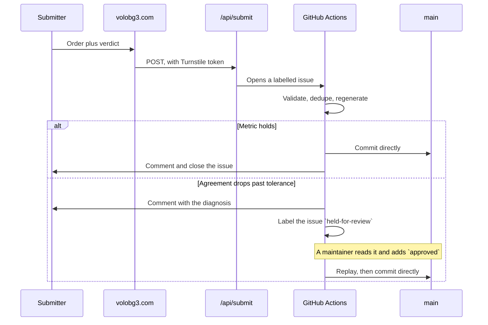

# Development workflow

## Prerequisites

Node 22 and npm. Nothing else; there is no backend to run.

## First-time setup

```bash
npm install
npm run dev        # http://localhost:5173
```

## Daily loop

```bash
npm run check      # typecheck
npm test           # the optimiser against the real corpus, then every tracked file
npm run build      # regenerate the masterlist, build, then prerender every route
```

The same three commands run on every push and pull request through
`.github/workflows/checks.yml`, so a dependency bump that does not even
install fails its pull request instead of waiting for someone to try it
locally. One did exactly that.

`npm run masterlist` re-mines `Load Orders - Public Submitted/` on its own. Run
it when new submissions arrive.

## Before changing how sorting works

```bash
node scripts/verify-holdout.mjs
```

Run it before and after. It rebuilds the masterlist once per working order with
that order left out, so it measures generalisation rather than memory. Quote
that number, not the higher one `verify-order.mjs` prints.

Several plausible ideas have measured worse. See [decisions.md](decisions.md)
before rebuilding one.

## After deploying

```bash
npm run verify-deploy -- https://volobg3.com --expect "some new string"
```

Checks every asset the live page references, in both plain and browser-style
CORS requests, repairing the edge cache if it is holding a bad answer. Pass
`--expect` with a string unique to the change to wait for that change to land.

It reads the live page rather than the local build on purpose: the host runs its
own build, which regenerates the masterlist and so produces different content
hashes. Comparing against local filenames waits forever.

It then requests every route and asserts an address that is not a route answers
404. Since each route is served from its own prerendered file rather than
through a rewrite, a route the prerenderer does not know about disappears in
production, and this is the only check that runs against the real host.

## Scripts

| Script | Purpose |
|---|---|
| `mine-corpus.mjs` | Builds the masterlist from the corpus. Supports `--exclude` and `--out`. |
| `prerender.mjs` | Renders every route to its own HTML file after the build. |
| `serve-dist.mjs` | Serves `dist/` the way the host does, which `vite preview` does not. |
| `build-sitemap.mjs` | Writes the sitemap, taking each `lastmod` from git. |
| `verify-order.mjs` | In-sample agreement. Relative comparisons only. |
| `verify-holdout.mjs` | Held-out agreement. The honest number. |
| `smoke-test.mjs` | Asserts the sort's promises against every corpus order. |
| `audit-repo.mjs` | Every tracked file: parses, links, secrets, personal data, style. |
| `diagnose-order.mjs` | Explains what is probably wrong with a broken order. |
| `process-submission.mjs` | Validates a submission, gates it, writes the report. |
| `corpus-provenance.mjs` | Records and reads how an order reached us: VOLO's own output or not, and what its submitter said. |
| `curated-rules.mjs` | Loads `masterlist/curated-rules.json` and checks each pattern. |
| `bulk-list-nexus.mjs` | Crawls the Nexus catalogue. `--updates` for the daily top-up. |
| `bulk-list-modio.mjs` | Crawls mod.io. `--updates` and `--deps`. |
| `crawl-requirements.mjs` | Harvests author-declared requirement tables. |
| `build-external-categories.mjs` | Maps both catalogues onto the group vocabulary. |
| `find-masterlist-on-nexus.mjs` | Matches masterlist mods to Nexus by name, ahead of the id crawl. |
| `enrich-from-nexus.mjs` | Reports what the Nexus catalogue can add to the masterlist. |
| `build-divider-map.mjs` | Turns the divider paks into the client's taxonomy. |
| `crawl-summary.mjs` | One readable summary of catalogue and masterlist state. |
| `verify-deploy.mjs` | Verifies and repairs a deployment, and checks every route. |
| `sync-figures.mjs` | Rewrites the figures quoted in README and decisions from the data. |

The rest are run by hand rather than by any pipeline, and exist for when the
question comes up again:

| Script | Run it when |
|---|---|
| `extract-separator-mods.mjs` | Astra ships new or changed divider paks |
| `learn-breakage.mjs` | Asking what broken orders do that working ones never do |
| `learn-category-order.mjs` | Re-deriving the category sequence as the corpus grows |
| `backfill-provenance.mjs` | An order has no provenance record, or a submitter's note is only in the issue. Dry run by default, `--write` to apply |

## Environment

`.env` holds `NEXUS_API_KEY` and `MODIO_API_KEY` for local crawling. The same
values live as repository secrets so the scheduled crawl runs without anyone's
machine being on. Crawling locally is no longer necessary.

## How a submission travels



The gate is one question, asked of every order: does it leave agreement intact.
An order that parses, is not a duplicate, and does not drop agreement by more
than one point lands on its own, whether its submitter said it worked or not.

Broken orders used to wait for a person on principle, because their value is the
written diagnosis. The diagnosis is posted to the issue either way, and holding
the order never made anybody read it; it only meant the corpus waited on somebody
being at a keyboard. What a broken order contributes settles whether that is
safe: it adds presence and the section headers its submitter wrote, and it never
contributes sequence, because `workingPositions` in the miner is built from
working orders alone. No ordering is learned from an order that did not run.

A held order waits on its own issue and is accepted by adding `approved`. There
is no branch and no pull request. Approval moves only the hold: the order still
has to parse, still has to be new, and still has to pass every check, so a label
cannot land something intake would refuse, and the label is removed once it has
landed something so a later edit cannot ride an old approval.

It used to open a corpus-only branch instead. That branch carried an order the
README did not describe, so its own checks failed on it, and the red mark showed
every time somebody looked, at exactly the moment they were deciding whether to
accept. Two open at once collided on `provenance.json`, because each added a
record to the same sorted map. None of it was load-bearing: approval replays from
the issue body, so the branch never reached main and was only ever a copy waiting
to be thrown away.

An order can arrive in the issue three ways, and intake tries each in turn
until one parses, because only parsing tells a populated field from a useful
one. It may be pasted into the body; it may be a file attached to the issue,
which is what dragging an export in produces and what the template invites; or
it may be staged, when the site found it too large for GitHub's 65,536
character issue body and wrote it to R2 instead, leaving a pointer, an entry
count and a checksum. A staged pointer is exclusive: the excerpt beside it is
deliberately not JSON, because a candidate that parses first would otherwise
land eight mods as somebody's load order.

Two bounds keep one submission from costing everything else. Entries are
capped after parsing, because the agreement measure compares every pair and a
six figure entry count would hold a runner until Actions killed it. And a
submission that validates but fails to land now says so on the issue rather
than thanking its submitter, which is what it used to do.

What the submitter wrote in the Notes box is kept alongside the order, in its
provenance record. It is stored as written and nothing reads it: the miner takes
only `sortedByVolo` from provenance, so a note changes no group, divider or
sequence. It exists because the order says what was installed and the metric
says how it sorted, and neither records a person saying which two mods fight.
Personal paths are stripped from it on the way in, GitHub's placeholder for an
empty box is not a note, and `backfill-provenance.mjs` fills in orders that
landed before any of this existed.

Re-adding the `load-order-submission` label replays an issue through current
intake. That is how orders rejected by an older version get another run
without asking anyone to file again, and it is the same lever `approved` pulls:
labelling replays the submission, and the label is what tells the gate the hold
has been answered.

Both labels have to exist in the repository. GitHub drops a label an issue asks
for when the repository does not have one by that name, silently and with no
error anywhere, which is how `wrong-placement` sat unread for its whole life.

## Where explanation lives

Comments explain why, never what. Anything longer than a sentence or two
belongs in this directory rather than in a source file.
