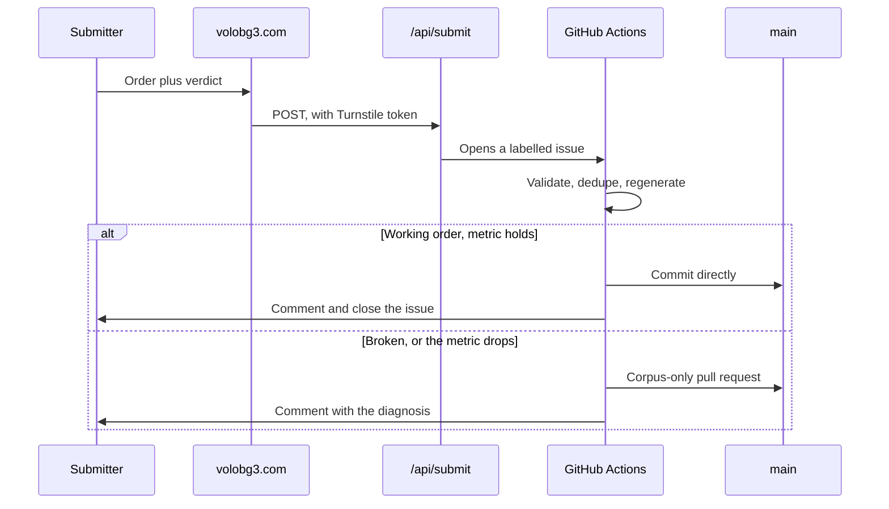

# Development workflow

## Prerequisites

Node 22 and npm. Nothing else; there is no backend to run.

## First-time setup

```bash
npm install
npm run dev        # http://localhost:5173
```

## Daily loop

```bash
npm run check      # typecheck
npm test           # the optimiser against the real corpus
npm run build      # regenerate the masterlist, build, then prerender every route
```

`npm run masterlist` re-mines `Load Orders - Public Submitted/` on its own. Run
it when new submissions arrive.

## Before changing how sorting works

```bash
node scripts/verify-holdout.mjs
```

Run it before and after. It rebuilds the masterlist once per working order with
that order left out, so it measures generalisation rather than memory. Quote
that number, not the higher one `verify-order.mjs` prints.

Several plausible ideas have measured worse. See [decisions.md](decisions.md)
before rebuilding one.

## After deploying

```bash
npm run verify-deploy -- https://volobg3.com --expect "some new string"
```

Checks every asset the live page references, in both plain and browser-style
CORS requests, repairing the edge cache if it is holding a bad answer. Pass
`--expect` with a string unique to the change to wait for that change to land.

It reads the live page rather than the local build on purpose: the host runs its
own build, which regenerates the masterlist and so produces different content
hashes. Comparing against local filenames waits forever.

It then requests every route and asserts an address that is not a route answers
404. Since each route is served from its own prerendered file rather than
through a rewrite, a route the prerenderer does not know about disappears in
production, and this is the only check that runs against the real host.

## Scripts

| Script | Purpose |
|---|---|
| `mine-corpus.mjs` | Builds the masterlist from the corpus. Supports `--exclude` and `--out`. |
| `prerender.mjs` | Renders every route to its own HTML file after the build. |
| `serve-dist.mjs` | Serves `dist/` the way the host does, which `vite preview` does not. |
| `build-sitemap.mjs` | Writes the sitemap, taking each `lastmod` from git. |
| `verify-order.mjs` | In-sample agreement. Relative comparisons only. |
| `verify-holdout.mjs` | Held-out agreement. The honest number. |
| `smoke-test.mjs` | Asserts the sort's promises against every corpus order. |
| `diagnose-order.mjs` | Explains what is probably wrong with a broken order. |
| `process-submission.mjs` | Validates a submission, gates it, writes the report. |
| `bulk-list-nexus.mjs` | Crawls the Nexus catalogue. `--updates` for the daily top-up. |
| `bulk-list-modio.mjs` | Crawls mod.io. `--updates` and `--deps`. |
| `crawl-requirements.mjs` | Harvests author-declared requirement tables. |
| `build-external-categories.mjs` | Maps both catalogues onto the group vocabulary. |
| `find-masterlist-on-nexus.mjs` | Matches masterlist mods to Nexus by name, ahead of the id crawl. |
| `enrich-from-nexus.mjs` | Reports what the Nexus catalogue can add to the masterlist. |
| `build-divider-map.mjs` | Turns the divider paks into the client's taxonomy. |
| `crawl-summary.mjs` | One readable summary of catalogue and masterlist state. |
| `verify-deploy.mjs` | Verifies and repairs a deployment, and checks every route. |

The rest are run by hand rather than by any pipeline, and exist for when the
question comes up again:

| Script | Run it when |
|---|---|
| `extract-separator-mods.mjs` | Astra ships new or changed divider paks |
| `learn-breakage.mjs` | Asking what broken orders do that working ones never do |
| `learn-category-order.mjs` | Re-deriving the category sequence as the corpus grows |

## Environment

`.env` holds `NEXUS_API_KEY` and `MODIO_API_KEY` for local crawling. The same
values live as repository secrets so the scheduled crawl runs without anyone's
machine being on. Crawling locally is no longer necessary.

## How a submission travels



The gate is deliberately narrow: a working order that parses, is not a
duplicate, and does not drop agreement by more than one point lands on its own.
Everything else waits for a person.

## Where explanation lives

Comments explain why, never what. Anything longer than a sentence or two
belongs in this directory rather than in a source file.
